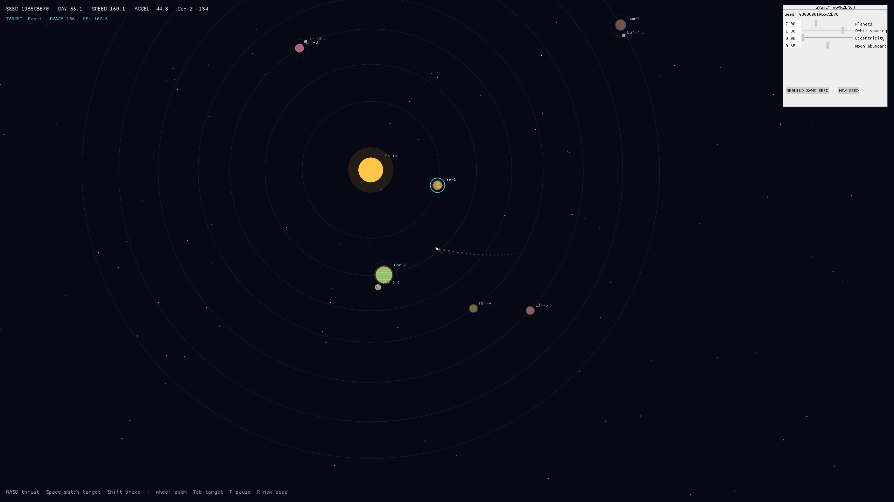

# Solanum

This is a small solar system simulation I made after playing [*Outer Wilds*](https://www.outerwilds.com/). If you've never heard of it, it's a game about exploring a small solar system and uncovering its story. What makes the game especially fascinating is that its universe isn't just a collection of scripted set pieces: it's all one big physics simulation, and the things that happen emerge from that.

I had also been wanting to experiment with Rust's [Macroquad](https://macroquad.rs/), so building my own miniature solar system felt like a good opportunity to do that.

[Play it in your browser.](https://hugorouillard.github.io/solanum/)



## Physics

Everything exists in one continuous space. Planets and moons follow nested Keplerian orbits, while the ship moves inertially under thrust and the combined gravity of every body. It starts with the velocity of the world it launches from and can collide with planetary surfaces.

The distances, times, masses, and gravitational constants are deliberately compressed for practicality. Orbital periods follow `T = 2π√(a³/GM)`, elliptical positions are found by solving Kepler's equation, and ship gravity uses softened inverse-square attraction.

## Run locally

```sh
cargo run --release
```

The app requires a graphical Linux, macOS, or Windows session supported by Macroquad.

## Controls

| Input                 | Action                                                                |
| --------------------- | --------------------------------------------------------------------- |
| `W` / `A` / `S` / `D` | Thrust |
| `Shift`               | Inertial brake                                                        |
| Hold `Space`          | Match the selected world's velocity                                   |
| Mouse wheel           | Zoom                                                                  |
| `Tab`                 | Select the next world                                                 |
| `P`                   | Pause simulation                                                      |
| `R`                   | Generate the next seeded system                                       |
